# Week 1-4

## Hongye Qian

### Computer resource

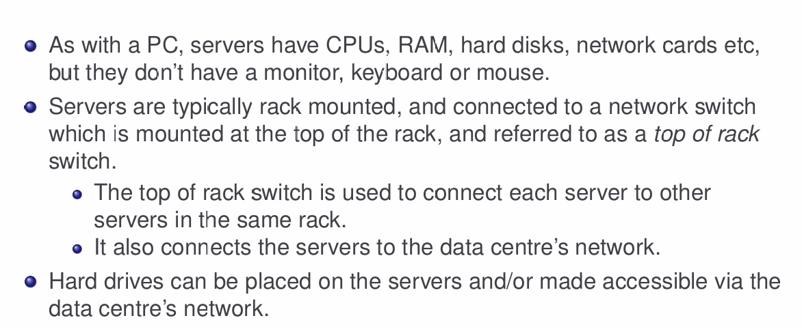

- 就像个人电脑一样，服务器也有 CPU、内存、硬盘、网卡等组件，但它们没有显示器、键盘或鼠标。
- 服务器通常安装在机架上，并连接到一个网络交换机。这个交换机安装在机架顶部，被称为“顶层交换机”（top of rack switch）。
  - 顶层交换机用于将每台服务器与同一个机架内的其他服务器连接起来。
  - 它还将服务器连接到数据中心的网络中。
- 硬盘可以直接放置在服务器上，也可以通过数据中心的网络进行访问。


##  Local Networks vs. The Internet

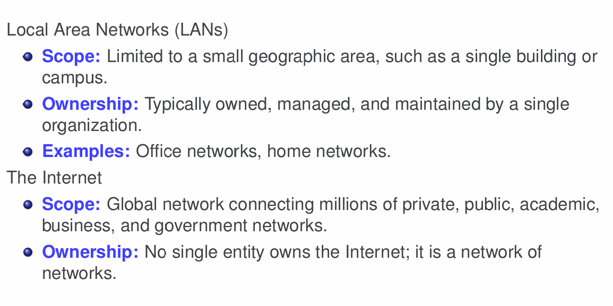

#### 局域网（LAN）

- **作用范围（Scope）**：局限于较小的地理区域，例如某栋建筑或一个校园。
- **所有权（Ownership）**：通常由一个组织拥有、管理和维护。
- **示例（Examples）**：办公室网络、家庭网络。

#### 互联网（The Internet）

- **作用范围（Scope）**：一个全球性的网络，连接了数以百万计的私人、公共、学术、商业和政府网络。
- **所有权（Ownership）**：互联网不属于任何一个单独实体；它是一个由多个网络组成的网络。

###  Network Interface Cards

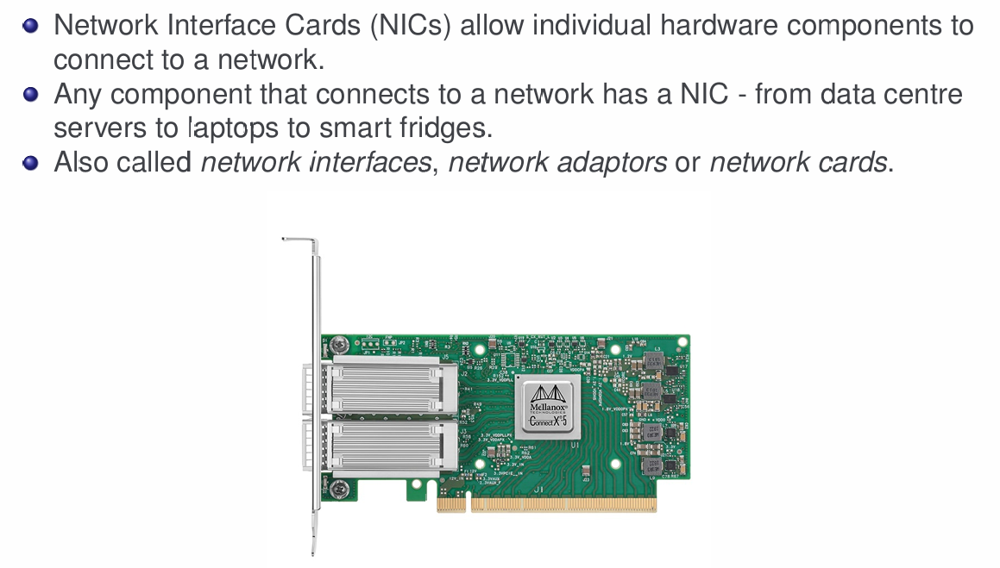

### MAC Address


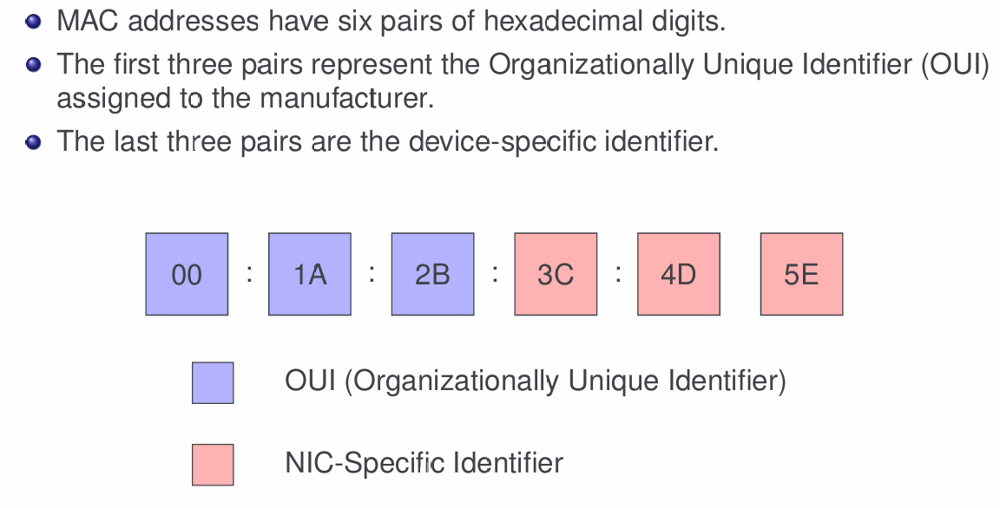

### Network Switches

Network switches connect devices within a single a computer network.


### Routers

Routers connect **multiple networks** together and facilitate the transfer of data between them.


Comparison to Network Switches: Routers focus on **directing traffic between networks**, while switches facilitate communication within **a single network**.


### FireWalls

Firewalls are **network security devices** that sit on the **boundary of a network** and monitor and filter **incoming and outgoing traffic**.

They work by **examining each packet of data** to determine whether it should be allowed through or not, based on **a set of rules**.


## Question 1

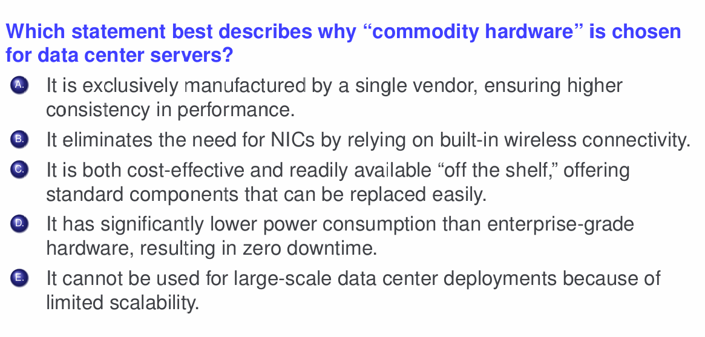

- Commodity hardware is **inexpensive, widely available**, and **easy to replace with standard off-the-shelf components**.


## Question 2 ( top-of-rack)

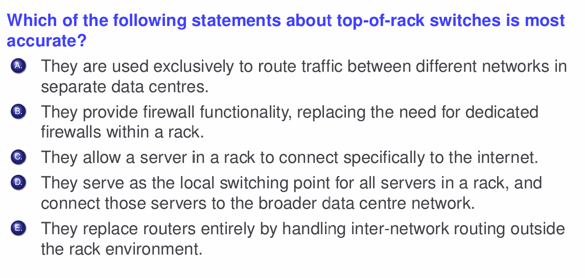

- The top-of-rack switch provides **local connectivity** for servers within the rack and also c**onnects them to the wider data center network**.


## Server Software

### Operating System

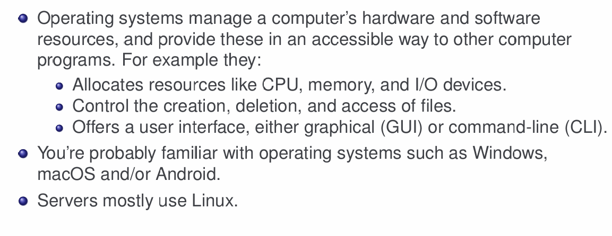

### Linux

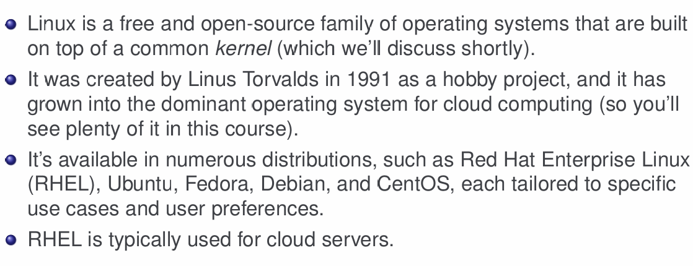


### The Linux kernel

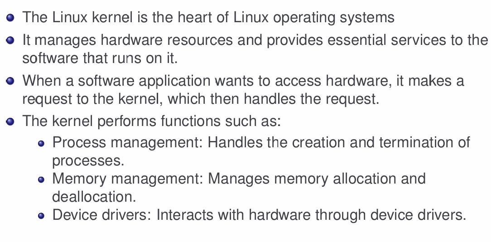

**Kernel Space**: This is where the kernel operates Code running in kernel space has complete access to the hardware. Code is run in a **protected memory area**, ensuring stability and security. 

**User Space:** This is where user applications run. User space processes have **limited access to the hardware** and must **communicate with the kernel for resource access**.


### The Root User

The root user is a special user account that has **the highest privileges** in the system (although as a user, it still operates in user space).

- modify system settings, manage user accounts
- be risky
- the potential to cause significant system damage if used improperly
- 用户非必要不用


### Virtual Machine ( Virtualisation)

**Virtualisation** is the process of **creating virtual versions of physical components** such as **servers, storage devices, networks, storage or NICs**.

**Virtual Machines (VMs):** Software emulations (模拟) of an entire physical server.

**Hypervisor**: A software layer runs on **a physical server** and enables **the creation and management of a number of virtual machines**.

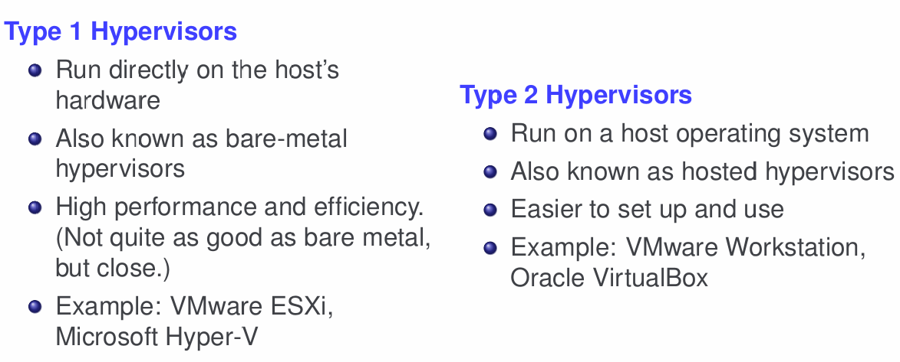

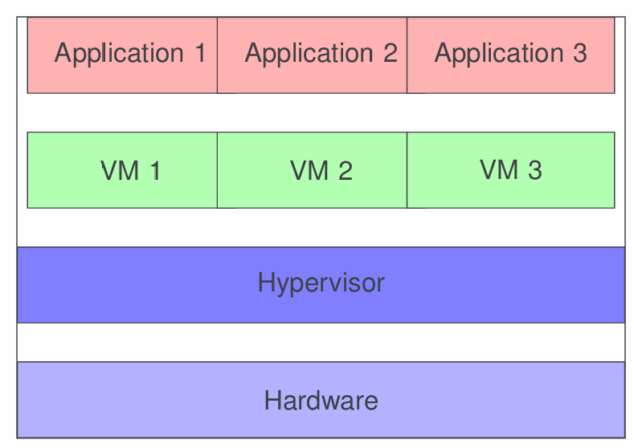

**Benefits**:

- **Efficiency**: Maximises resource utilisation. 
- **Cost Savings**: Reduces the need for **physical hardware**. 
- **Flexibility**: **Eases the deployment and management** of IT environments. 
- **Isolation**: To some extent, provides **secure and isolated environments for different applications**. (Although more robust isolation can be achieved with sandbox solutions such as SELinux, as we’ll see later in the course.)


## Question 1  (Linus Kernel)

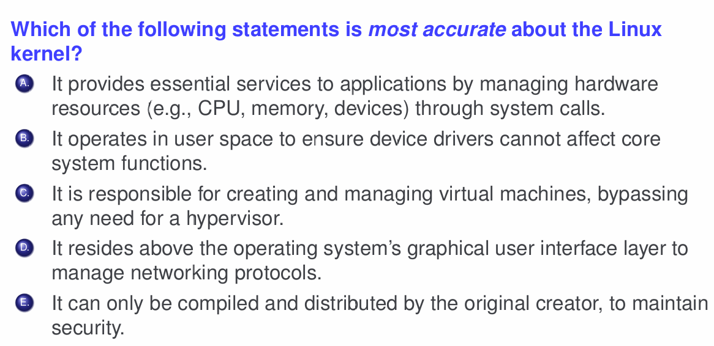

 The kernel provides services by **managing processes, memory, and devices**, **exposing this functionality through system calls**.


 ## Question 2 (visualization)


**Type 1** (bare-metal) hypervisors run directly on the host hardware; they usually have lower overhead than **Type 2** (hosted) hypervisors.


## HTML, CSS and JavaScript

- HTML(Hyper Text Markup Language) is the **standard markup language** for creating **web pages**. It describes the **structure of a web page** and it’s used along with CSS to design the layout of the web page. 
- CSS (Cascading Style Sheets) is **a style sheet language** used for describing **the look and formatting** of a document written in HTML. It provides the visual aspects of the web page that HTML is not designed to do. 
- JavaScript is an **object oriented programming language**. It is supported by **all web browsers**, and can be used to program **how web pages behave in response to user interaction**.


Hypertext: Text that links to other text or documents. 链接文本

Markup: A system for annotating text in documents. 注释文本


### HTML Tags and Elements

- **tags** define elements

```
<body> and </body>
```

### The DOM

The DOM(Document Object Model) is **a programming interface for web documents**. 

It represents the structure of a document **as a tree**, and allows programs to **manipulate the document’s structure, style, and content**. 

The DOMis initially populated from the page’s HTML. HTML tags become nodes in the tree, and these nodes can be manipulated using JavaScript. 

Once populated, the DOM can be manipulated with JavaScript, allowing JavaScript programmers to **change the web page in response to users’ actions** (e.g users clicking buttons etc.)


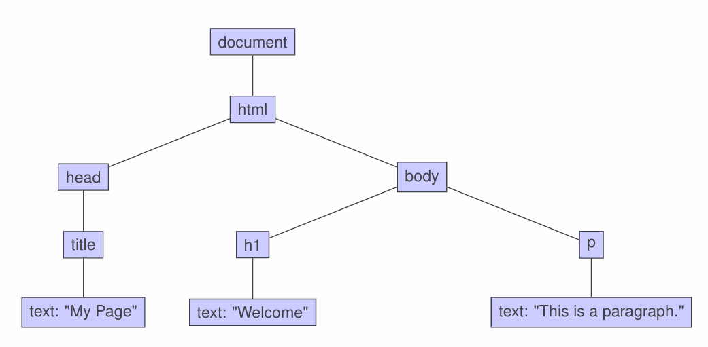

### CSS

改样式的

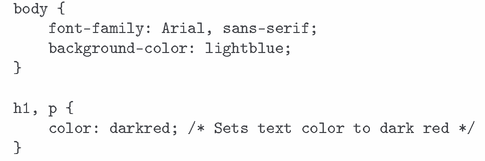


How to link?

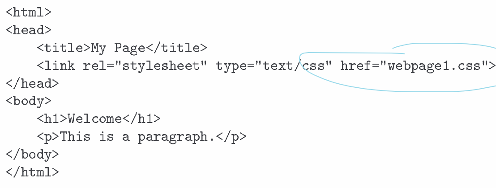

### HTML Element Attributes

class: Specifies one or more class names for an element. The class attribute is m**ostly used to point to a class in a style sheet.** However, it can also be used by **JavaScript to access and manipulate elements with the specific class name**. 

id: Specifies a unique id for an element. The id attribute is used to point to **a style in a style sheet**, and by **JavaScript (via the DOM) to manipulate the element with the specific id**. 

style: Specifies inline CSS style for an element.

### Tailwind CSS

有些样式自己可以不写，用这个东西

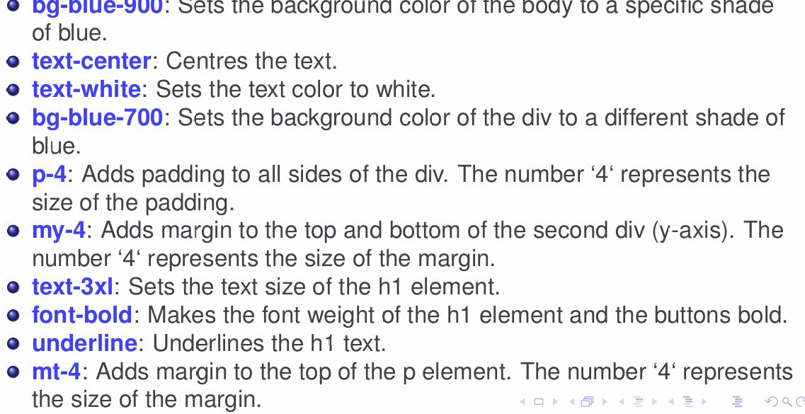

### JavaScript

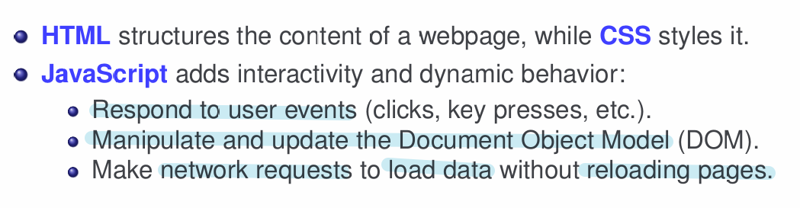


## Question 5 (DOM)

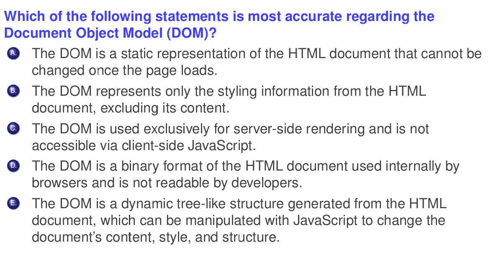

The DOMis **a dynamic tree-like structure** generated from the HTML document.


## Question 1 (HTML)

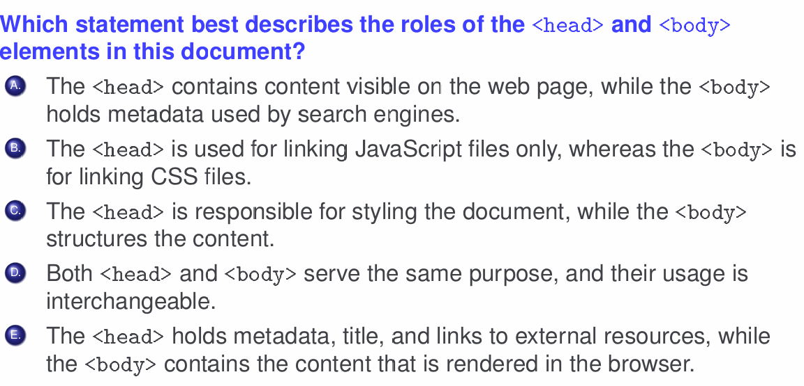

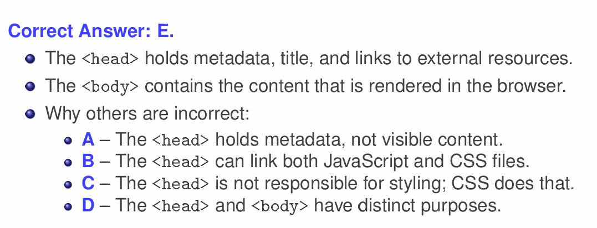

## Question 4(HTML CSS JavaScript)

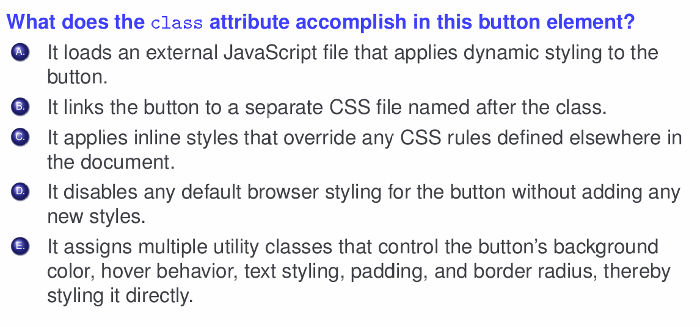

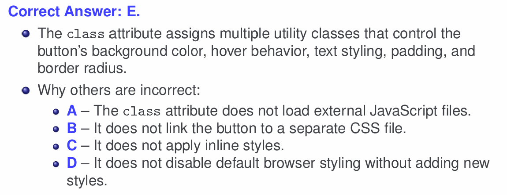


### JavaScript

P98  很简单

唯一和后端那些不太一样就是这个语言不是强语言


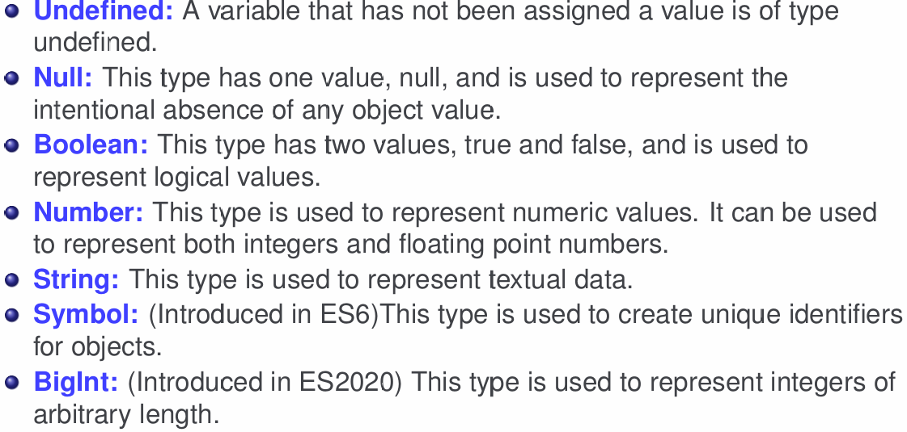

- **Let：** `let` 关键字用于声明变量。它具有块级作用域，意味着变量仅在声明它的代码块内有效。
  - `let` 声明的变量可以被更新，但不能被重复声明。
  - 与下面的 `var` 相比，`let` 更现代，并且由于其块级作用域的特性，通常是更推荐的变量声明方式。

- **Const：** `const` 关键字用于声明不能被重新赋值或重新声明的变量。
  - `const` 也是块级作用域，像 `let` 一样。
  - 当变量在初始赋值后不应再更改时，使用 `const`。

- **Var：** `var` 关键字也用于声明变量。它是 `let` 的较旧替代方案，行为复杂，一般建议避免使用。
  - `var` 是函数级作用域的，而不是像 `let` 和 `const` 那样的块级作用域。


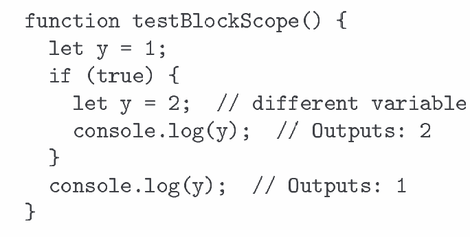


- **Truthiness（真假性）：** 在 JavaScript 中，一个值在布尔上下文中表现为 “真” 或 “假”，比如在 if 语句中使用时的行为。

- **Truthy 值：** 在布尔上下文中被视为 `true`。除非被明确定义为 falsy，大多数值都属于 truthy。
  - 例如：`{}`, `[]`, `42`, `"false"`, `new Date()`, `-42`, `3.14`, `-3.14`, `Infinity`, `-Infinity`，所有对象。

- **Falsy 值：** 在布尔上下文中被视为 `false`。
  - 例如：`false`, `0`, `-0`, `0n`, `""`, `null`, `undefined`, `NaN`


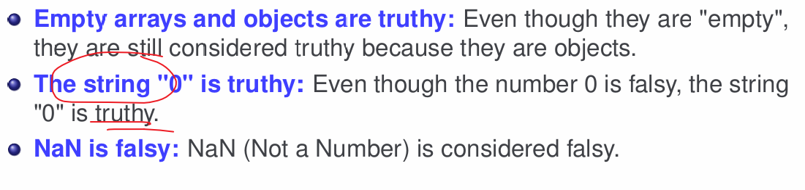

- **双等号（==）：** 双等号运算符会在比较的两个变量类型不同的情况下进行类型转换（类型强制转换）。
  - 示例：`1 == "1"`  // 输出：`true`

- **三等号（===）：** 三等号运算符，也称为严格相等运算符，不会进行类型转换。
  - 示例：`1 === "1"`  // 输出：`false`


### Array P110

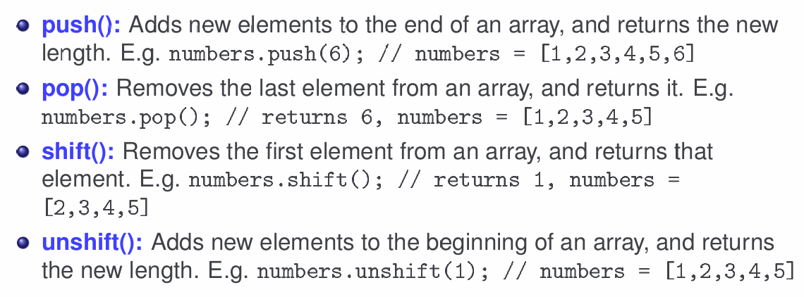

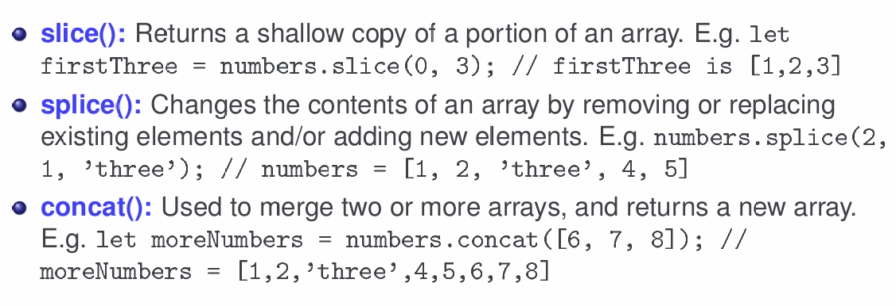

### Object

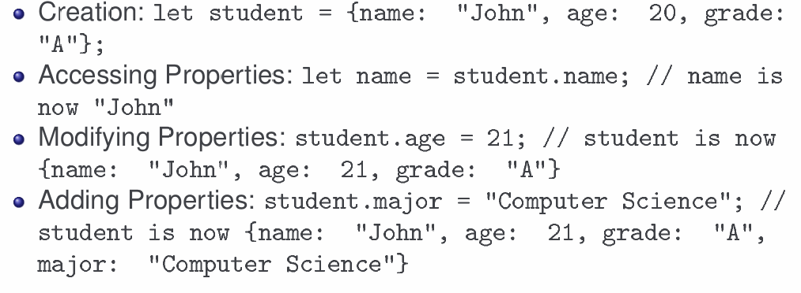

## Question 1 (JavaScript)

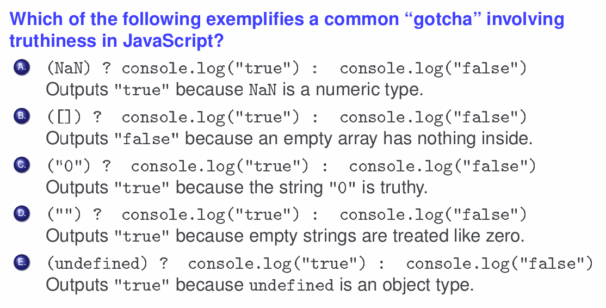

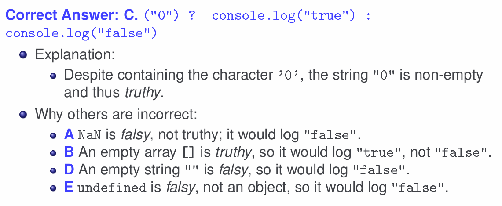

## Question 2 (JavaScript)

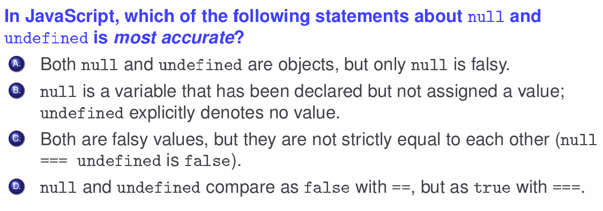

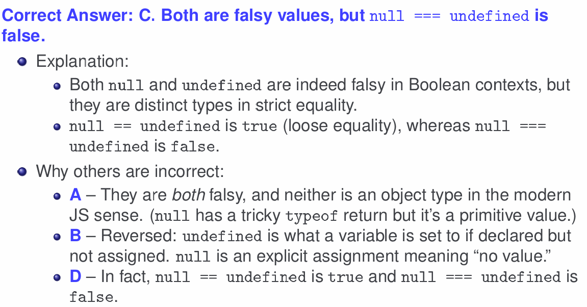

## Question 3 (JavaScript)

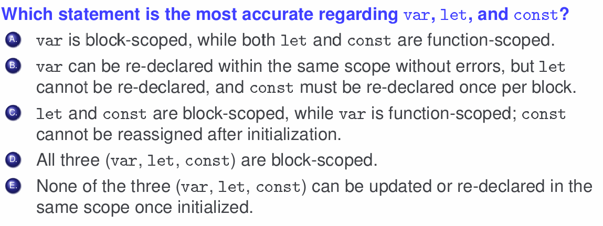

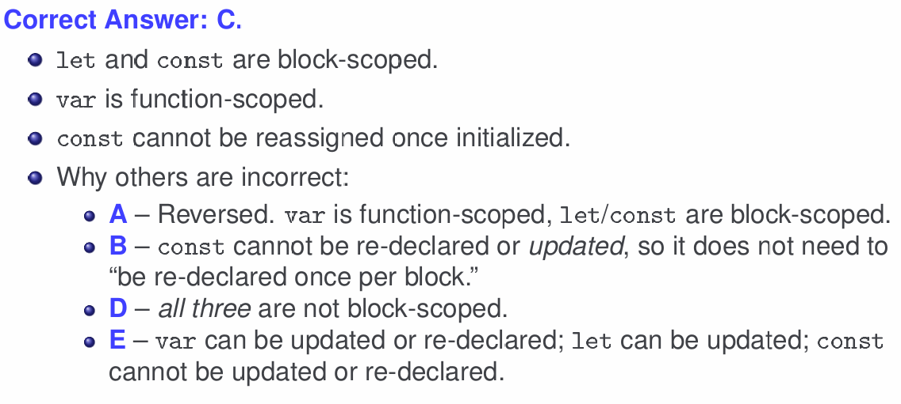


## Security

### The Patch Cycle and the Zero-Day Problem

 The **patch cycle** involves discovering a **vulnerability, preparing and publishing a patch, and users installing the patch**.


**Zero-day vulnerabilities**, for which no patch is yet available, **can be exploited in attacks, even against systems that are up-to-date with all vendor patches**. 


### Host defence

### The Principle of Least Privilege

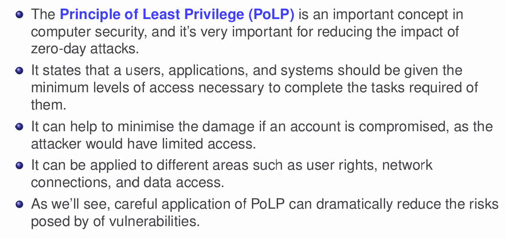

- **最小权限原则（PoLP, Principle of Least Privilege）** 是计算机安全中的一个重要概念，对于减少零日攻击的影响非常关键。

- 该原则指出：用户、应用程序和系统应仅被授予完成任务所需的最低限度访问权限。

- 如果账户被攻破，该原则可以帮助将损害降到最低，因为攻击者只能获取有限的权限。

- PoLP 可应用于多个领域，如用户权限、网络连接和数据访问等。

- 正如我们将看到的，谨慎应用 PoLP 原则可以显著降低漏洞带来的风险。


### Sandboxes and SELinux

- **沙箱（Sandboxing）** 是指在受限环境中运行程序，从而限制它们的权限（符合最小权限原则 PoLP）。

- 它通常不能阻止零日漏洞的利用。然而，即使攻击者成功利用了一个零日漏洞，在沙箱中的程序也只能访问沙箱所允许的权限范围。

- 在 Linux 中，一个非常流行的沙箱实现是 **SELinux（Security-Enhanced Linux）**。

- SELinux 使用一种叫做 **强制访问控制（Mandatory Access Control, MAC）** 的机制，以非常细粒度的方式限制程序的权限。

- 我们稍后会更详细地介绍 SELinux，但首先我们会看看 Linux 中默认的访问控制形式，称为 **自主访问控制（Discretionary Access Control, DAC）**。


### Discretionary Access Control

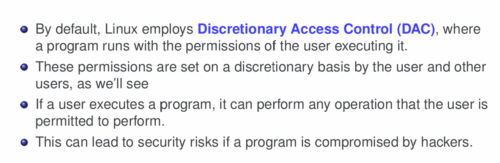

- 默认情况下，Linux 使用**自主访问控制（DAC, Discretionary Access Control）**，即程序运行时会继承执行该程序用户的权限。
- 这些权限是由用户或其他用户根据自主决定设置的。
- 如果用户执行一个程序，该程序就可以执行所有该用户被允许执行的操作。
- 如果程序被黑客攻破，这种机制可能会带来安全风险。


### Privilege Escalation

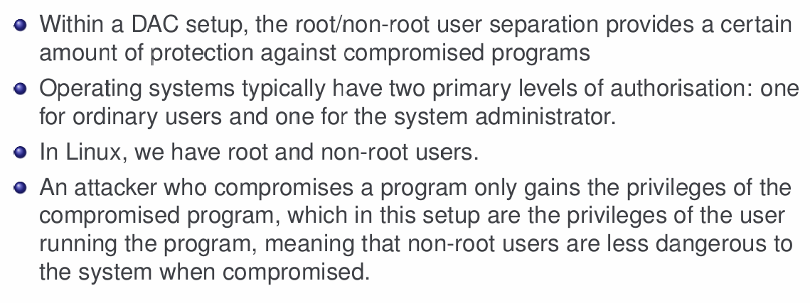

- 在 DAC 设置中，root 用户与非 root 用户的隔离机制为防止程序被攻破提供了一定程度的保护。

- 操作系统通常有两个主要的授权等级：一个是普通用户，另一个是系统管理员。

- 在 Linux 中，我们有 root 用户和非 root 用户。

- 攻击者如果攻破了某个程序，只能获得该程序所拥有的权限。在这种设置下，这些权限就是运行该程序的用户的权限，也就是说，如果被攻破的是非 root 用户，那么对系统的威胁相对较小。


###  File Permissions in Linux

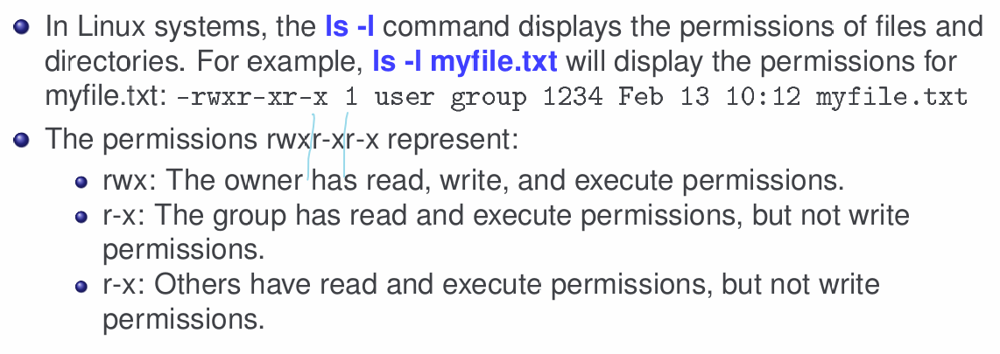

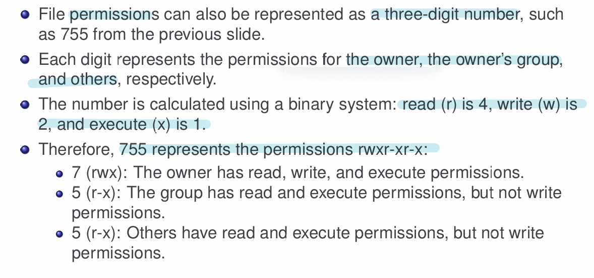

### Discretionary Access Control in Linux (chmod, sudo, superuser)

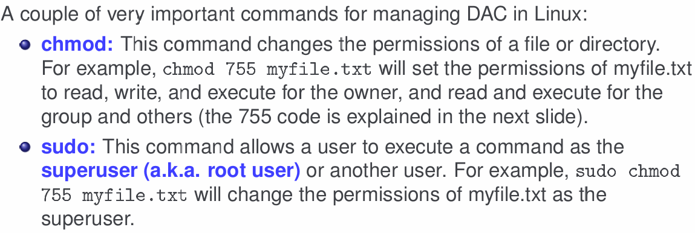

### Mandatory Access Control (MAC)

- MAC（Mandatory Access Control，强制访问控制）是一种访问控制方式，操作系统会限制某个主体（用户或进程）对对象或目标执行操作的能力。

- 在 MAC 中，用户对其文件的访问控制权非常有限。只有系统管理员能够设定哪些用户可以访问哪些文件，并且这些策略对所有用户和程序都是**强制性的（mandatory）**。

- 在 Red Hat 企业版 Linux 中，MAC 是通过一个叫做 SELinux 的解决方案来实现的。


### SELinux Modes

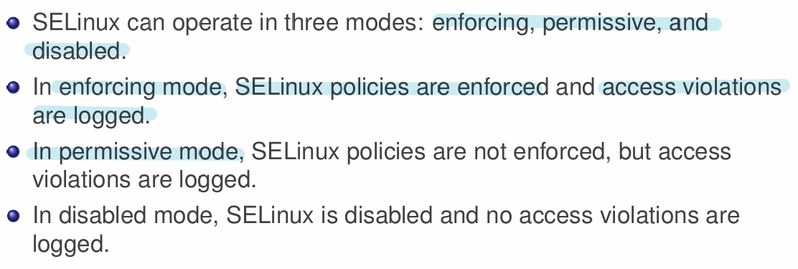


### Labelling in SELinux

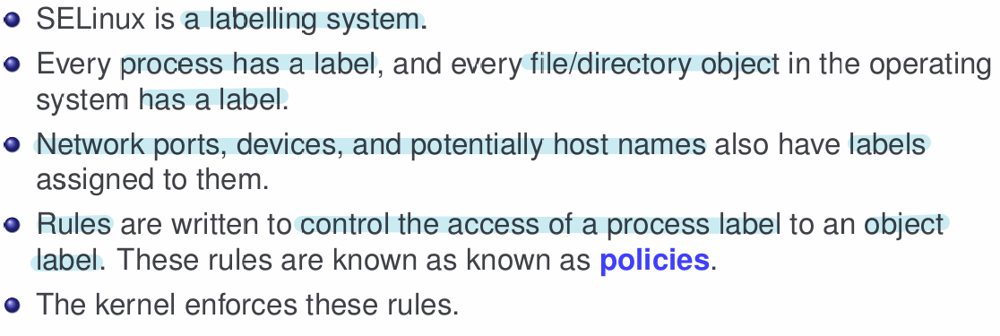

### Type enforcement example

Week 4 P 180


### Multi Level Security (MLS) Enforcement

- **多级安全机制（Multi Level Security, MLS）** 是 SELinux 提供的另一项安全机制。

- 其核心概念是：根据数据的安全等级来控制进程的访问权限。例如，一个拥有 “机密（secret）” 级别权限的进程，无法访问 “绝密（top-secret）” 的数据。

- 类比来说，这就像不再区分不同的狗，而是区分狗的品种，比如灵缇犬（Greyhound）和吉娃娃（Chihuahua）。


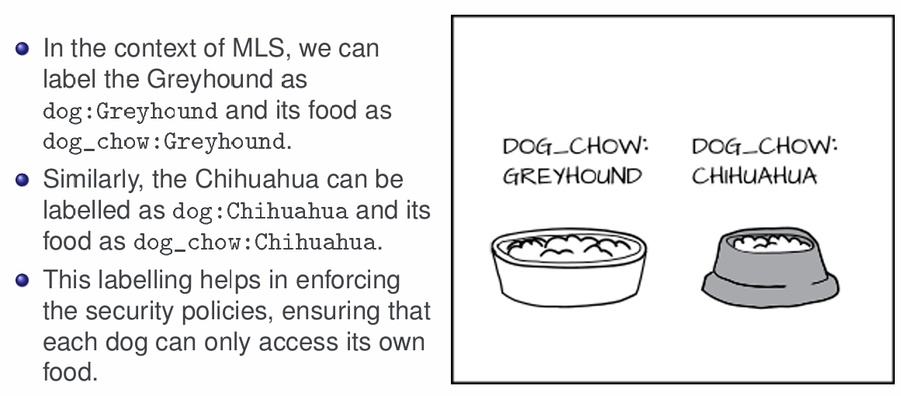

###  MLSPolicy in Action

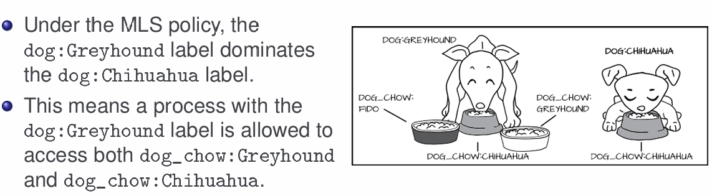

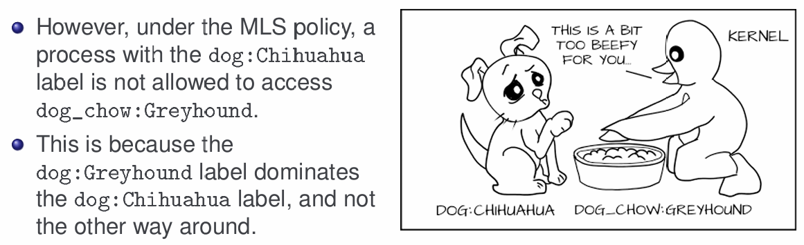

### MLSand Type Enforcement

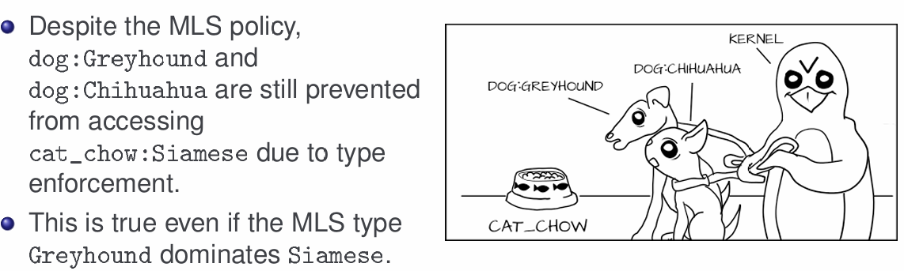

## Containers

Containers are **a lightweight alternative** to **virtual machines**, which start almost instantaneously, are much less resource-intensive, and are far easier to create and manage.


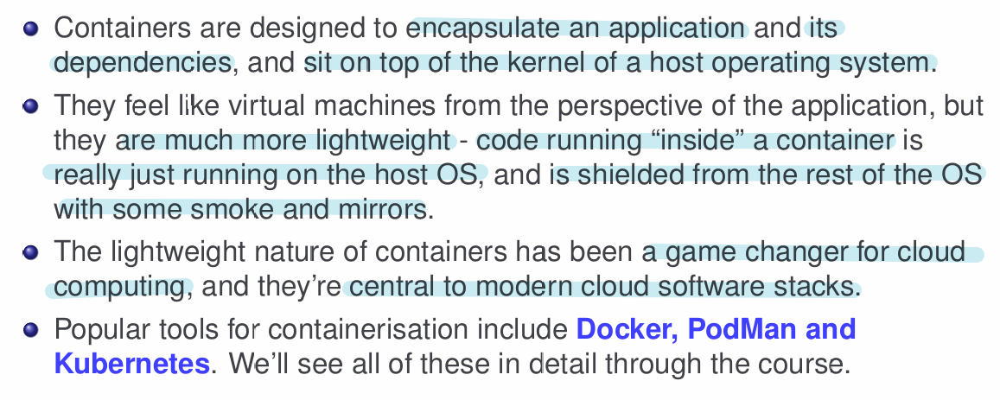

- 容器的设计目的是封装应用程序及其依赖项，并运行在宿主操作系统内核之上。

- 从应用程序的角度来看，容器像是虚拟机，但实际上它们更加轻量——在容器“内部”运行的代码，其实就是在宿主操作系统上运行，并通过某些技术手段与宿主系统其他部分隔离开来。

- 容器的轻量特性彻底改变了云计算的发展方向，它们是现代云软件架构的核心组成部分。

- 常见的容器化工具包括 **Docker**、**PodMan** 和 **Kubernetes**。


### Tech Stack for Containers

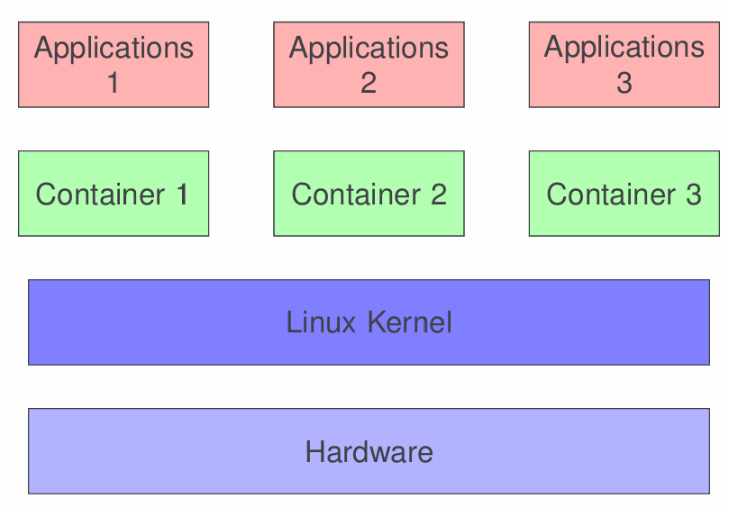

### Containers+Virtualisation

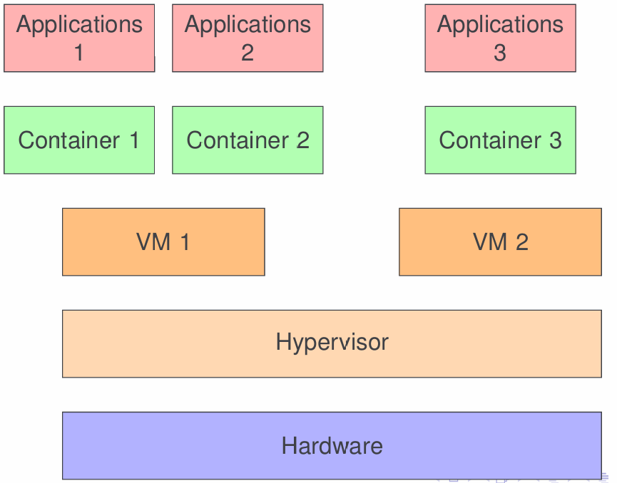


### Docker

- Docker 是当前最知名的容器化解决方案。

- 在 Docker 中，容器是通过 **镜像（images）** 创建的，而这些镜像是通过 **Dockerfiles** 定义的（我们之后会学习到）。

- 例如，当 Docker 安装完成后，我们可以拉取一个标准的 Ubuntu 镜像：

  ```bash
  docker pull ubuntu:latest

该命令会从主镜像仓库（Docker Hub）中下载最新的 Ubuntu 镜像。

下载完成后，我们可以使用以下命令运行一个容器：

```
docker run -it ubuntu:latest /bin/bash
```

- 这个命令会启动一个新的容器，并开启一个带交互式终端的 bash shell。

#### Example

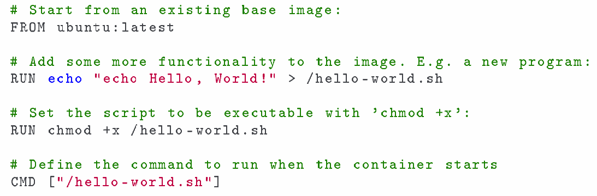

### Running docker

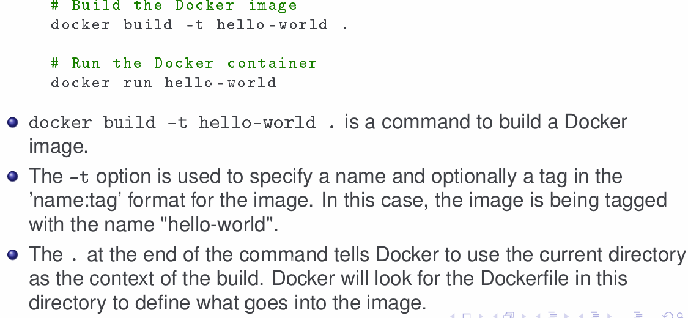

### Dockerfile Elements

- 一个 Dockerfile 的关键组成部分包括：

  - **基础镜像（Base image）：** 指定一个已有的镜像，作为当前新镜像的构建基础。

  - **构建指令（Instructions）：** 定义构建镜像的步骤，例如安装依赖、复制文件、配置环境等。

  - **命令（Commands）：** 在构建过程中，在镜像内执行的命令。

  - **暴露端口（Exposed ports）：** 指定当容器运行时需要开放的端口。

  - **入口点（Entrypoint）：** 定义从镜像启动容器时应执行的命令。


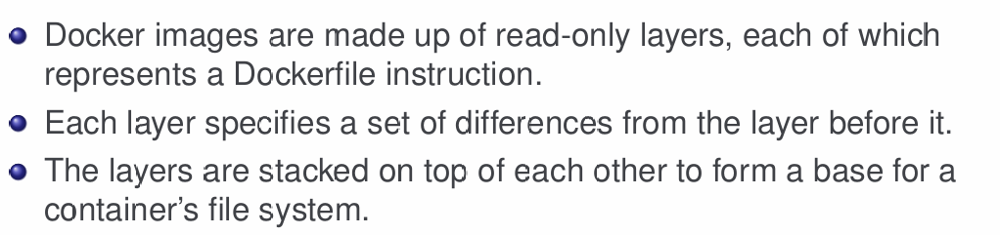


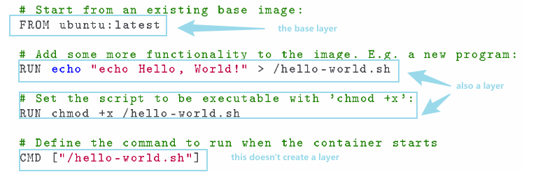


### Creating container

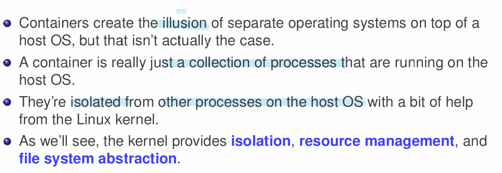

### Namespaces

- Linux 命名空间是 Linux 内核的一项功能，用于为一组进程隔离系统资源。

- 命名空间确保每组进程看到的都是其自身隔离的全局资源实例。

- 命名空间的类型包括：
  - **PID：** 隔离进程 ID 编号空间。
  - **NET：** 网络命名空间，用于虚拟化网络栈。
  - **MNT：** 管理挂载点（文件系统）。
  - **UTS：**（UNIX 时间共享）隔离主机名和域名。
  - **IPC：** 隔离进程间通信。
  - **USER：** 提供权限隔离和用户标识分离。

- 每个容器都运行在自己独立的一组命名空间中，从而提供隔离的运行环境。


### Control Groups (cgroups)

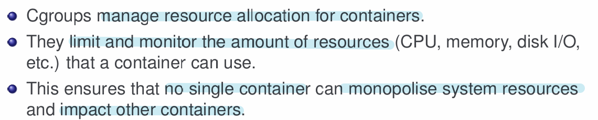


###  Union File Systems

- Union File Systems **provide a layered file system**. 

- They allow **containers to share a read-only base file system**, while maintaining separate writeable layers for each container.


###  Containers and the Proliferation of Services

- 到目前为止，我们已经了解了容器化的概念，以及如何使用 Docker 命令行接口运行单个应用程序。

- 容器化使我们能够以非常便捷的方式运行 **服务（services）**，而这种方式原本需要大量手动配置来搭建一个 **服务器（server）** 环境供应用程序运行。

- 实际上，容器可以被看作是部署服务的一站式解决方案，也就是说，拥有足够云计算资源的组织可以运行数百万甚至数十亿个容器。
  - 例如，Google 每周运行 **数十亿个容器（several billion containers per week）**。

- 接下来我们将学习：
  - **Kubernetes：** 一种 **编排软件（orchestration software）**，用于在云中大规模管理容器。
  - **微服务（Microservices）：** 一种软件架构风格，能够利用容器运行大量小型、独立的服务组件。


###  Orchestration (管弦乐？？？)

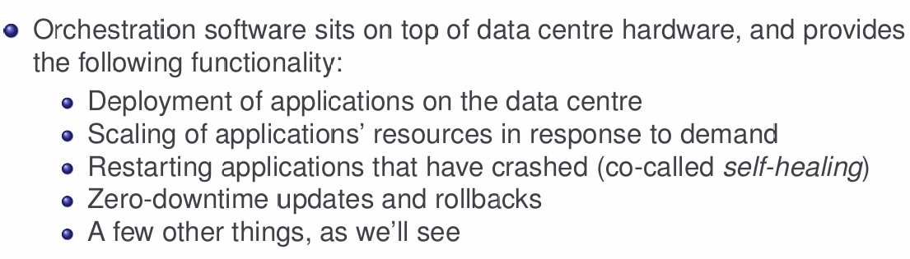

- 编排软件（Orchestration software）运行在数据中心硬件之上，并提供以下功能：

  - 在数据中心部署应用程序  
  - 根据需求对应用程序资源进行扩展  
  - 重启崩溃的应用程序（即所谓的**自我修复**）  
  - 无中断地进行更新和回滚  


### Kubernetes

- 最流行的容器编排系统是 Kubernetes。

- Kubernetes 是开源的，它的主要目标是自动化容器的部署、扩展和运行操作。

- 它运行在数据中心服务器上，屏蔽底层硬件的复杂性，提供一个简单的接口用于运行容器。

- 因此，Kubernetes 常被比作是**数据中心的操作系统**：
  - 就像传统操作系统为 PC 和服务器屏蔽了底层硬件（CPU、内存、网卡等）的复杂性，提供运行程序的简单接口，
  - Kubernetes 也提供类似功能，但它**不仅服务于单台计算机，而是服务于整个数据中心中成百上千的计算节点**。


### History of Kubernetes

P220


### Borg and Omega

P221


### CRI and OCI

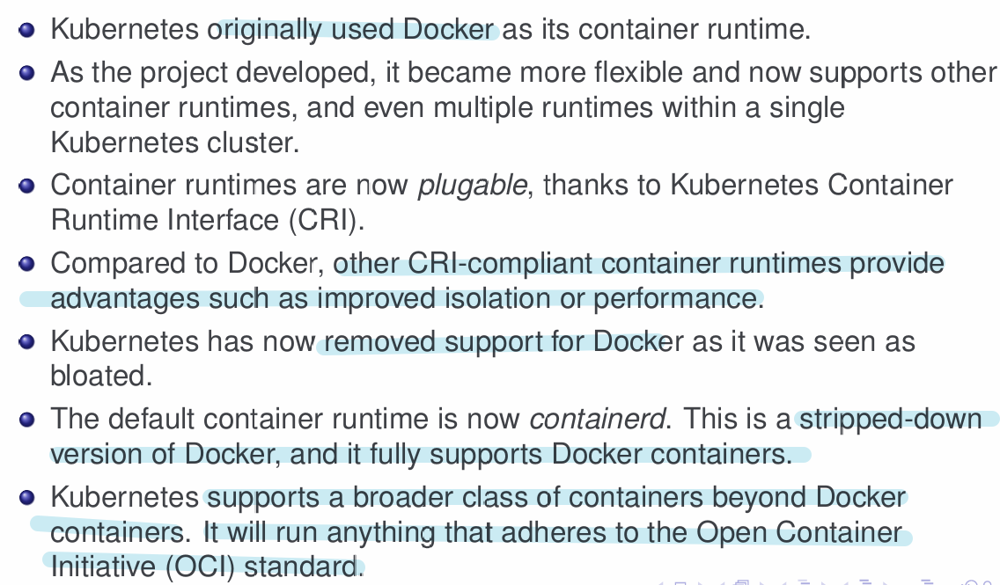

### Microservices and Monoliths

- 正如我们将看到的，Kubernetes 带我们进入一个容器可以轻松启动并大规模部署的世界。

- 在这种背景下，我们可以开始用不同的方式思考应用程序。

- 与其将整个应用部署在一个容器中，不如将应用拆分为多个容器组成的集合来部署。

- 这就是 **微服务（microservices）** 背后的理念。

- 每个容器运行一个单一服务，整个应用由多个服务组成。

- 由于容器部署非常方便，它们可以将某些小的功能部分作为 **服务（services）** 提供（因此称为“微服务”）。

- 这种做法替代了传统方式——过去的应用程序常常被打包成一个 **单体（monolith）**：
  - 即：将整个应用的代码打成一个大包，彼此紧密交织，常常包含数百万行代码。


## Network

### Protocols and Protocol Stacks

-  it’s all made possible by **a set of protocols** that **run between the hardware components** along **the route between your computer and the web server**.
-  A protocol is **the equivalent of a conversation between two machines**. It’s a set of rules that define how two machines should interact and exchange information.
- Networking protocols are organised into stacks, where **the lowest levels in a stack provide basic services**, such as **transmission of bits over physical cables (通过物理电缆传播比特)**, or relaying small packets of data across local networks.
-  These low level protocols are then used by higher level protocols to provide more complex services, such as reliable delivery of data across continents, and secure communication.


**TCP/IP**: 

- Stands for Transmission Control Protocol/Internet Protocol. 
- Is the most widely used protocol stack, and is used in **web browsers and networked devices**.

**OSI:** 

- Stands for **Open Systems Interconnection**. 
- Is a conceptual framework that **provides a standardised way** to understand and discuss network protocols and their interactions.


## The OSI model

|  | 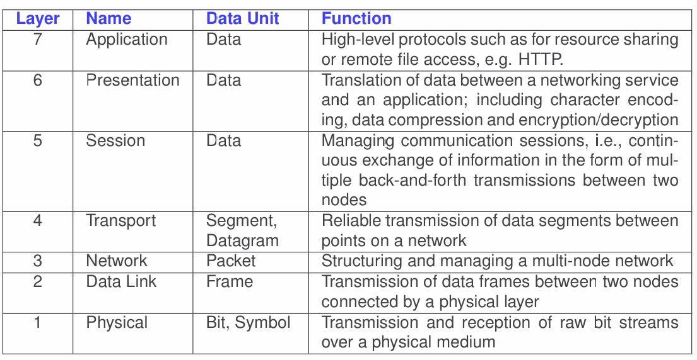 |
| ------------------------------------------------------------ | ------------------------------------------------------------ |

### The OSI Model vs The TCP/IP Stack

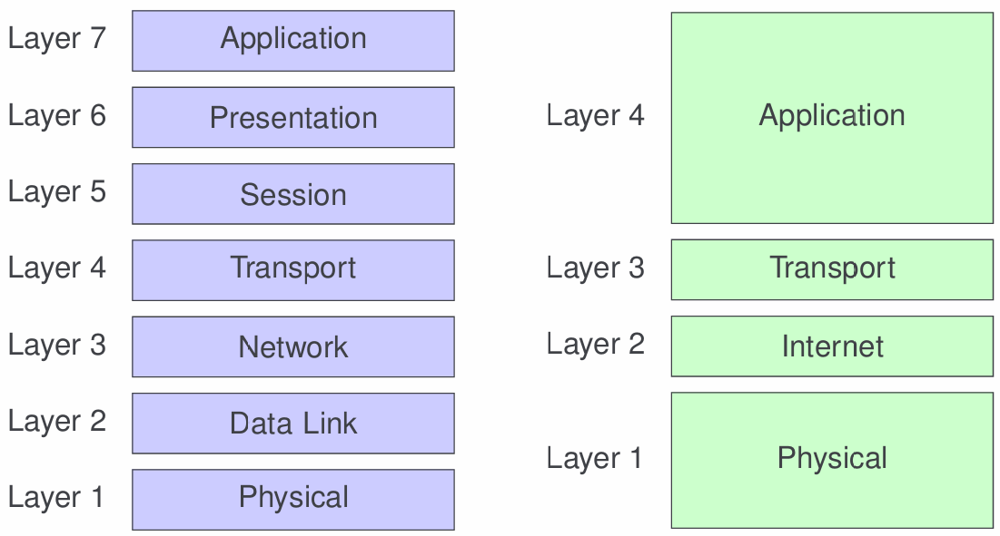

###  3 Types of Address

protocal stacks 用地址来communicate


### Layer 1: Physical Layer

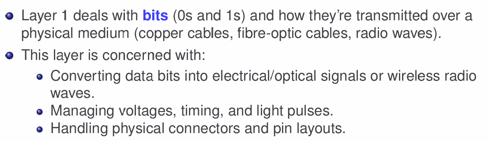


###  Layer 2: The Data Link Layer (Ethernet)

- 第二层（Layer 2），也叫做**数据链路层（Data Link Layer）**，关注的是**物理上接近并能直接通信的设备**。

- 示例包括家庭网络内部连接，或数据中心机架内部的连接（例如使用顶层交换机 top-of-rack switch）。

- 它使用 **以太网协议（Ethernet protocols）**，将比特组织成 **帧（frames）**，以实现可靠传输。

- 以太网通信由 **交换机（switches）** 控制，这些交换机通常被称为 **以太网交换机（Ethernet switches）** 或 **二层交换机（L2 switches）**。

- 在数据中心中，顶层交换机（top of rack switch，见第 1 周内容）负责维护连接该机架中所有服务器的以太网网络，因此它本质上是一个以太网交换机或 L2 交换机。（而且它通常也具备一些三层功能，用于将机架连接到更广域的网络中。）


### Ethernet Frames

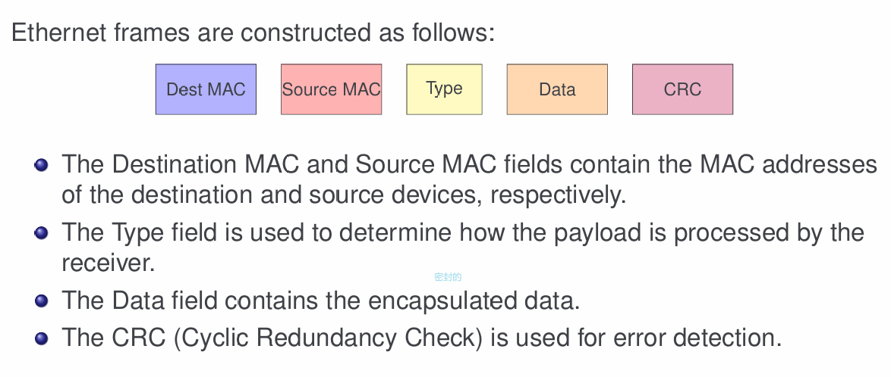


###  MACAddress Refresher

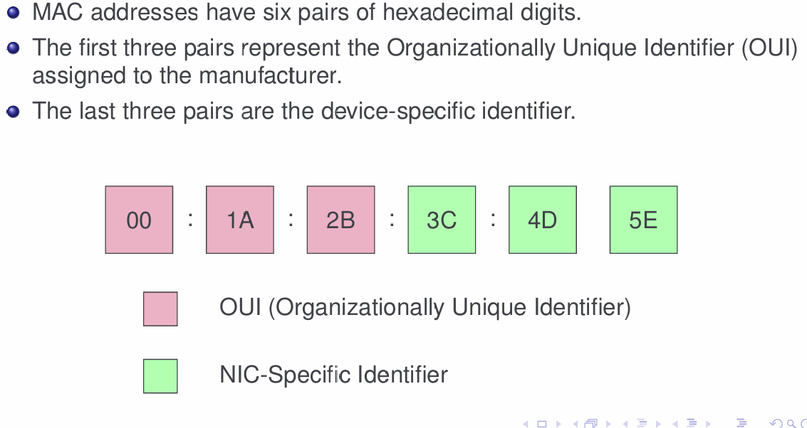


###  Layer 3: The Network Layer

- 第三层（Layer 3）负责**逻辑寻址（logical addressing）**和**路由（routing）**数据。

- 它使用如 **IP（Internet Protocol）** 等协议来决定数据传输的最佳路径。

- **路由器（Routers）** 工作在这一层，用于在不同网络之间转发数据包。

- 你可以把这一层类比成邮政系统，确保数据包从源头发送到世界上的任意目的地。

- 就像邮政服务有时会丢信一样，第三层也可能在传输过程中**丢失数据包（loose packets）**。


### Internet Protocol (IP)

- **IP（Internet Protocol，互联网协议）** 是 OSI 模型中**网络层（第三层）**的关键协议。

- 它负责根据 IP 地址将数据包从源主机发送到目标主机。

- IP 是一种无连接服务，这意味着每个数据包都被独立处理，可以走不同路径到达目标。

- IP 的核心功能包括：

  - **地址分配（Addressing）：** 给网络中的设备分配唯一的 IP 地址。

  - **路由选择（Routing）：** 确定数据包在网络中传输的最佳路径。

  - **分片与重组（Fragmentation and Reassembly）：** 将大的数据包拆分成更小的片段进行传输，在目标处重新组装。

  - **包转发（Packet Forwarding）：** 将数据包从一个网络段转发到另一个。


**two versions**:

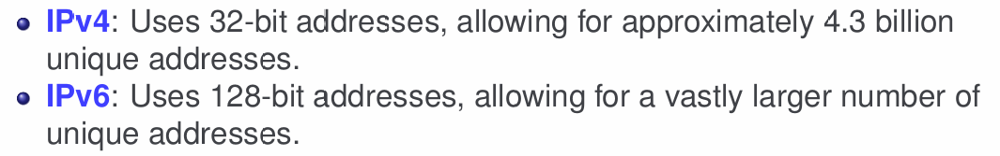


###  IPv4 Address Format

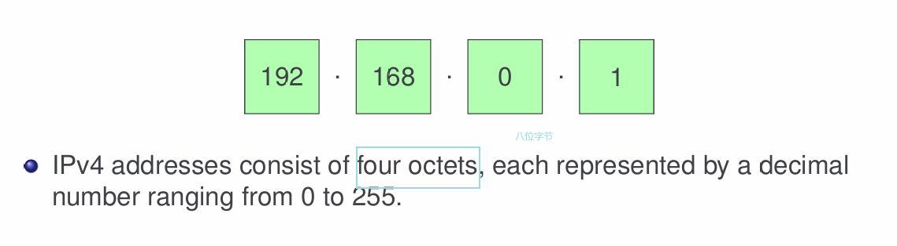


###  IPv6 Address Format

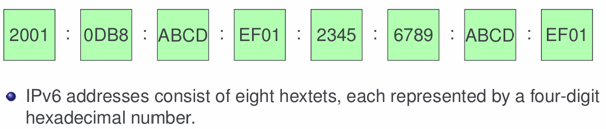


###  Layer 4: The Transport Layer

- **传输层（Transport Layer）** 确保设备之间的端到端通信，负责管理数据传输的**质量与可靠性（quality and reliability）**。

- 常见的协议包括：

  - **TCP（传输控制协议，Transmission Control Protocol）：** 提供**可靠、有序、并带有错误校验**的数据流传输（与第三层的 IP 相对）。

  - **UDP（用户数据报协议，User Datagram Protocol）：** 提供一种优先考虑速度而非可靠性的服务。

  - **SSL（安全套接字层，Secure Sockets Layer）** 与 **TLS（传输层安全协议，Transport Layer Security）：**
    提供网络中的安全通信，通过加密传输数据。


### TCP and UDP Protocols

- 第四层（传输层）相关的关键协议包括 **TCP（传输控制协议）** 和 **UDP（用户数据报协议）**。

- **TCP** 提供**可靠、有序并经过错误检查**的数据流传输，适用于运行在通过 IP 网络通信的主机上的应用程序之间。

- 不需要可靠数据流服务的应用程序可能会使用 **UDP**，因为它优先考虑传输时间而非可靠性。

- **UDP** 提供**不可靠的通信**，适用于那些优先考虑**速度而不是可靠性**的应用场景。

- 对时间敏感的应用（例如直播视频）通常会使用 UDP，因为**丢包**总比等待重传导致的延迟更可接受——在**实时系统中**，重传往往并不可行。


### Port number

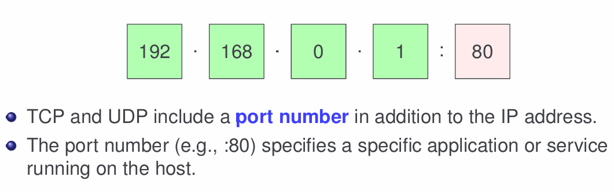


### SSL and TLS

- **SSL（安全套接字层，Secure Sockets Layer）** 和 **TLS（传输层安全协议，Transport Layer Security）** 是用于保护网络通信的协议。

- **SSL** 是最早的协议，但由于存在安全问题，已被 **TLS** 取代。

- **TLS** 是对 SSL 的改进版本，目前被广泛使用。

- 这两种协议都使用加密技术，确保通过网络传输的数据是**私密且安全**的。


### Properties of Connections Secured by TLS

- **机密性（Confidentiality）：** 连接是私密的，因为数据通过对称密钥算法进行加密。每个连接会使用在会话开始时协商生成的唯一密钥。

- **加密协商（Encryption Negotiation）：** 在数据传输之前，服务器和客户端会协商使用哪种加密算法和密钥。这一协商过程确保连接的安全性和可靠性。

- **身份验证（Authentication）：** 通信双方的身份可以通过公钥加密方式进行验证。服务器必须进行身份验证，而客户端身份验证是可选的。

- **完整性（Integrity）：** 连接是可靠的，因为每条消息都包含完整性校验。该校验通过消息认证码（MAC）来防止在传输过程中数据丢失或被篡改。


###  TLS Handshake Procedure

- 一旦客户端和服务器同意使用 TLS，它们会通过握手（handshaking）过程协商建立一个有状态的连接。

- 握手开始于客户端连接到支持 TLS 的服务器，**请求建立安全连接，并向服务器发送支持的密码套件列表**。

- 服务器从中**选择一个密码算法和哈希函数（它也支持的），并将选择结果通知客户端**。

- 接着，服务器通常会提供一个**数字证书**作为身份标识。证书中包含服务器名称、可信任的**证书颁发机构（CA）**、该机构对证书真实性的担保，以及服务器的公钥。

- 客户端在继续之前，会确认该证书的有效性。

- 然后，客户端生成用于建立安全连接的**会话密钥（session key）**。

- 握手至此完成，安全连接正式建立。此后通信内容将使用会话密钥进行加密和解密，直到连接关闭。

- 如果上述任一步骤失败，则 TLS 握手失败，连接不会建立。


### Certificate Authorities


### Layer 5: The Session Layer

- 会话层（Session Layer）负责通信会话的**建立（establishment）**、**维护（maintenance）**与**终止（termination）**。

- 它处理**对话控制（dialog control）**，使应用程序能够将交换组织成有意义的会话。

- 例如，它可以管理一个网络会话中的多个**登录（logins）**或连接。

- 这个层就像一个主持人，确保应用程序之间的对话顺利进行。


### Layer 6: The Presentation Layer

- 表示层（Presentation Layer）负责**数据转换（data translation）**和**格式化（formatting）**。

- 它处理的任务包括：**加解密（encryption/decryption）**、**压缩（compression）**以及**格式转换（format conversion）**。

- 此层确保一个系统应用层发送的数据，能被另一个系统的应用层正确识别与读取。

- 你可以把它理解为网络中的“翻译器”或“格式整理者”。


### Layer 7: The Application Layer

- **应用层（Application Layer）** 直接向终端用户提供服务（例如：**网页浏览器、电子邮件客户端、文件传输程序**）。

- 常见的协议包括：**HTTP、SMTP、FTP、DNS**。

- 这一层就像是网络的**用户界面（user interface）**，让用户能够直接进行交互。


###  HTTP and HTTPS

- **HTTP** 代表“超文本传输协议（Hypertext Transfer Protocol）”。

- HTTP 是一个**应用层协议**（第七层），它需要一个底层且可靠的传输层协议，通常使用 **TCP**。

- 然而，HTTP 也可以适配不可靠的协议，比如 **UDP**。

- **HTTPS** 末尾的 “S” 代表 “**Secure**”，意思是：你与网站之间的通信是加密的。

- HTTPS 在 HTTP 的基础上，额外使用了**传输层安全协议（TLS）**，或其前身 **SSL（安全套接字层）**，以实现安全通信。


### HTTP Methods AKA Verbs

- HTTP 定义了一组**请求方法（request methods）**，用于指明对某个资源要执行的操作：

  - **GET：** 请求获取指定资源的表现形式。GET 应该只用于读取数据，不应产生其他副作用。

  - **POST：** 向指定资源提交实体，通常会引起服务器状态的变化或产生副作用。

  - **PUT：** 用请求负载中的内容**替换目标资源的所有当前表示**。

  - **DELETE：** 删除由 URI 指定的目标资源的所有当前表示。

  - **PATCH：** 用于对资源进行**部分修改**。


## Question 1 (Networking)

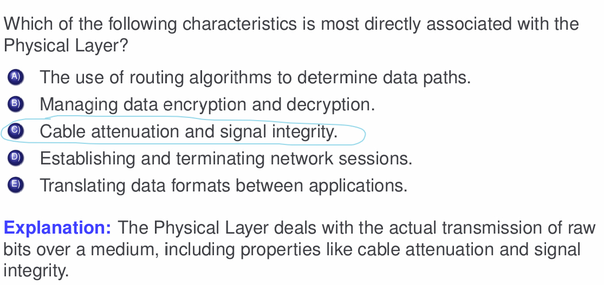


## Question 2(Networking)

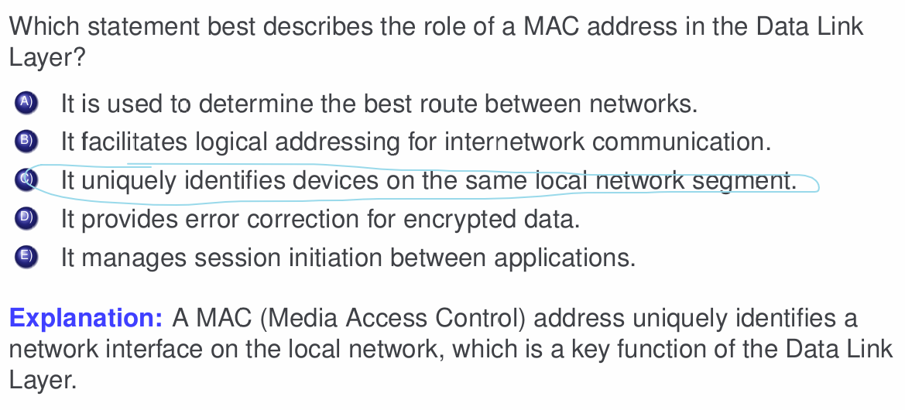


## Question 3(Networking)

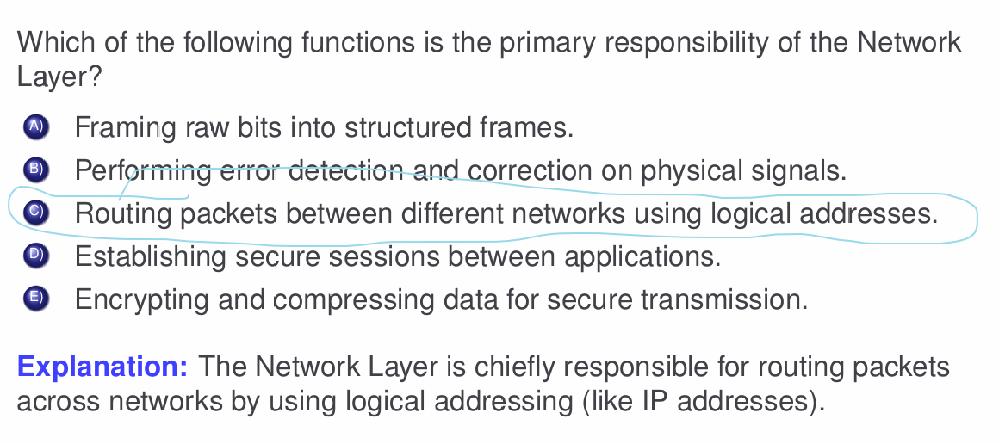

## Question 4(Networking)

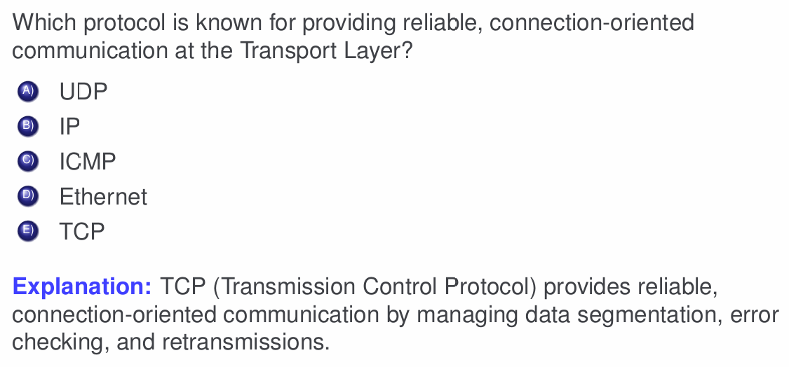


## Question 5(Networking)

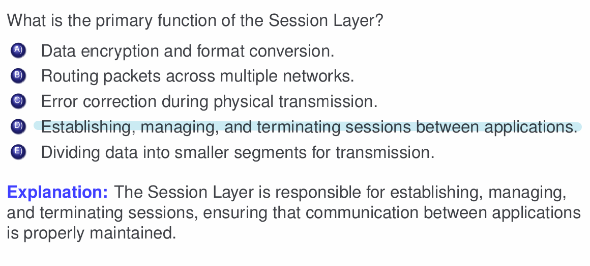


## Question 6(Networking)

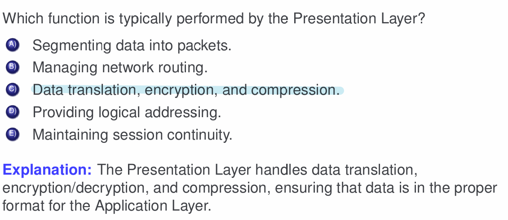


## Question 7(Networking)

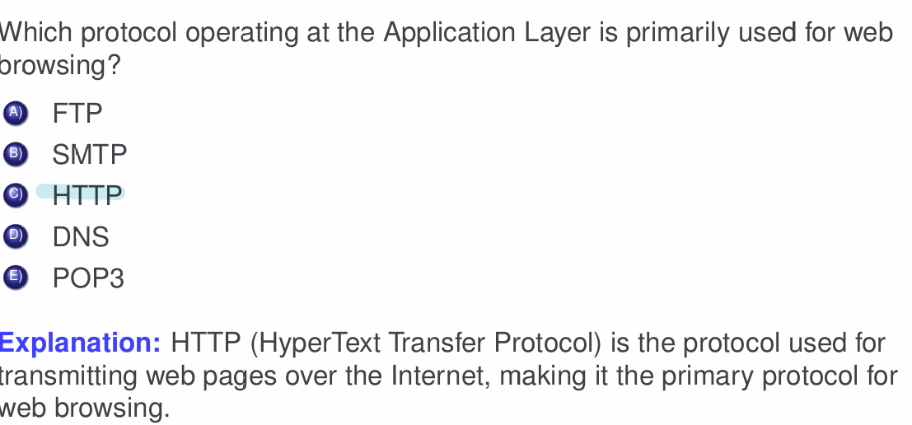


## Question 8(Networking)

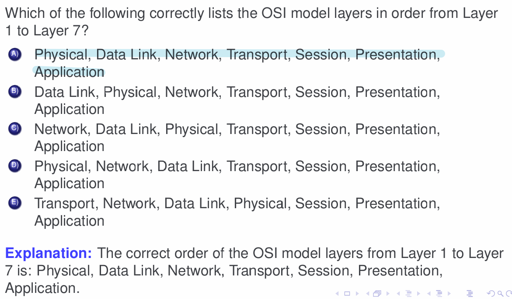


## Ansible I

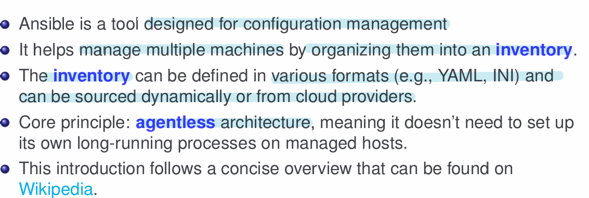


### Agentless Architecture

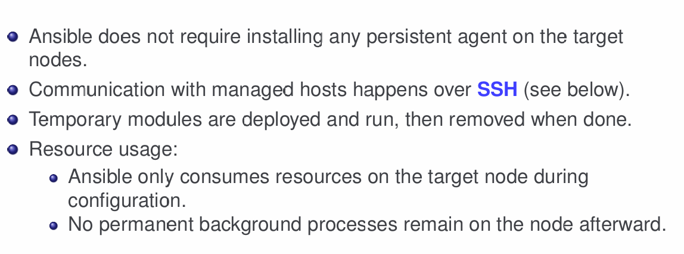


### SSH

- **SSH（Secure Shell）** 是一种用于安全连接远程计算机的协议。

- 它常用于远程命令行登录和远程命令执行。

- 在 Windows 系统中，可以使用 **PuTTY** 工具通过 SSH 连接远程服务器。

- 在 Linux 或 mac 系统中，可以通过命令行使用以下命令连接远程服务器：

  ```bash
  ssh username@remote_host

- 运行该命令后，系统会提示你输入远程用户的密码。

- 一旦验证成功，你就可以访问远程服务器的命令行了。


###  Agentless Architecture II

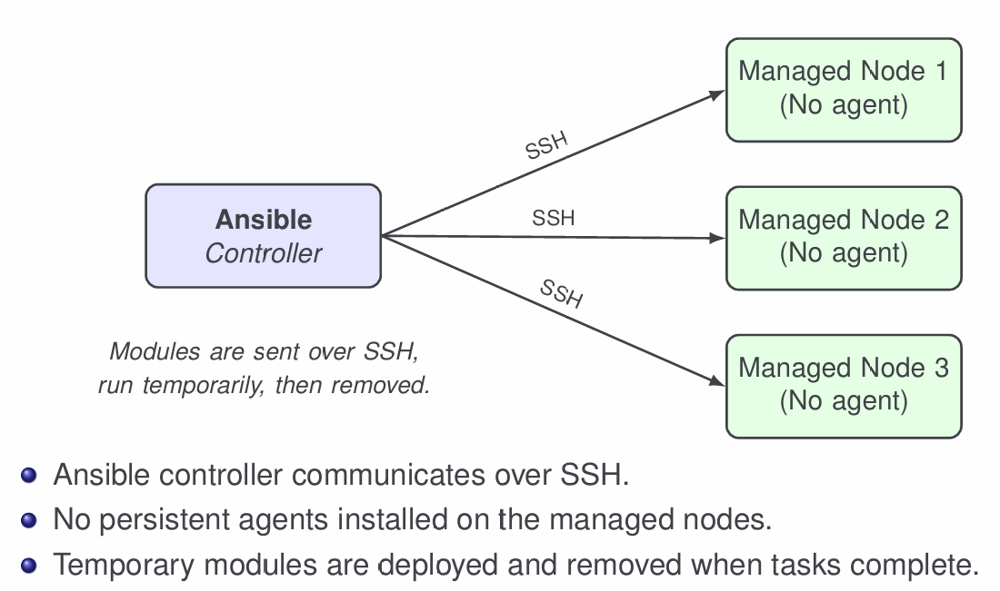


### Ansible Inventory

- Ansible 依赖一个 **inventory（清单）** 来追踪主机信息。

- **清单文件（inventory files）** 可以是：

  - 静态的：定义在文本文件中（本课程将使用这种方式）。
  - 动态的：从外部源（如云 API）中提取主机数据（较高级）。

- **Groupings（分组）** 允许选择特定子集的机器来执行特定任务。

- Ansible 支持多种清单文件格式（如 **YAML** 或 **INI** 文件）。


### Ansible Workflow

- **Playbooks（剧本）**：定义在特定 inventory 中每台主机所需的配置状态。

- 使用 YAML 语法（第 2 周）。

- 当一个 Playbook 执行时：

  1. Ansible 通过 SSH 连接到每个目标主机。
  2. 临时安装并运行所需的模块。
  3. 模块通过标准输入输出以 JSON 格式与 Ansible 控制器通信。
  4. 任务完成后，模块被移除。

- 部署完成后，受控节点不会额外运行任何服务。


###  Playbooks and Idempotency

- 在 **Ansible** 中，我们通过 **Playbook** 指定系统的“理想状态”。

- 一个重要特性：**幂等性（idempotent）**
  - 意思是：只有在必要时才做出更改。
  - 同一个 Playbook 可以重复运行，但不会产生副作用。
    -  如果系统已处于目标状态，不会再改动。
    -  如果不在目标状态，会自动改成目标状态。

- **优点**：
  - 可以放心地重复运行 Playbook，无需担心产生非预期效果。
  - 例如：Playbook 安装了某软件，若已安装，再运行一次不会重复安装。


### Inventory Files

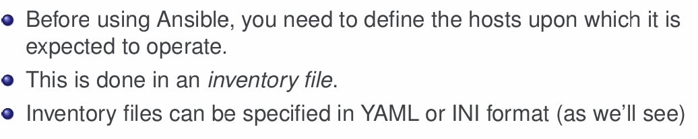


| 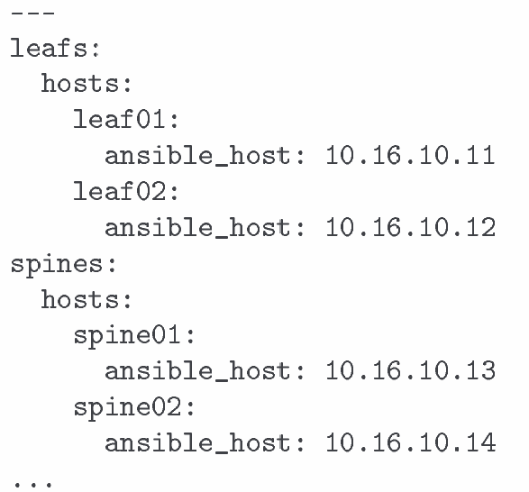 | 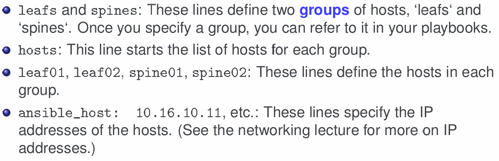 |
| ------------------------------------------------------------ | ------------------------------------------------------------ |


| 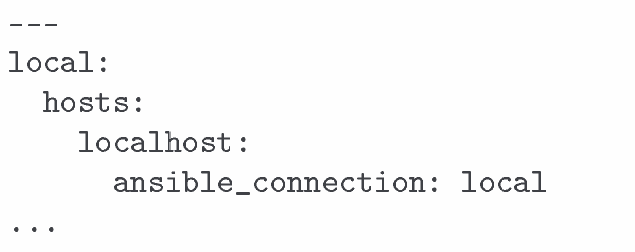 | 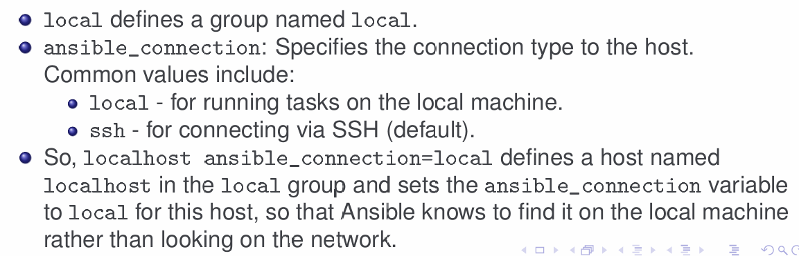 |
| ------------------------------------------------------------ | ------------------------------------------------------------ |


### Ansible Command Line Tool

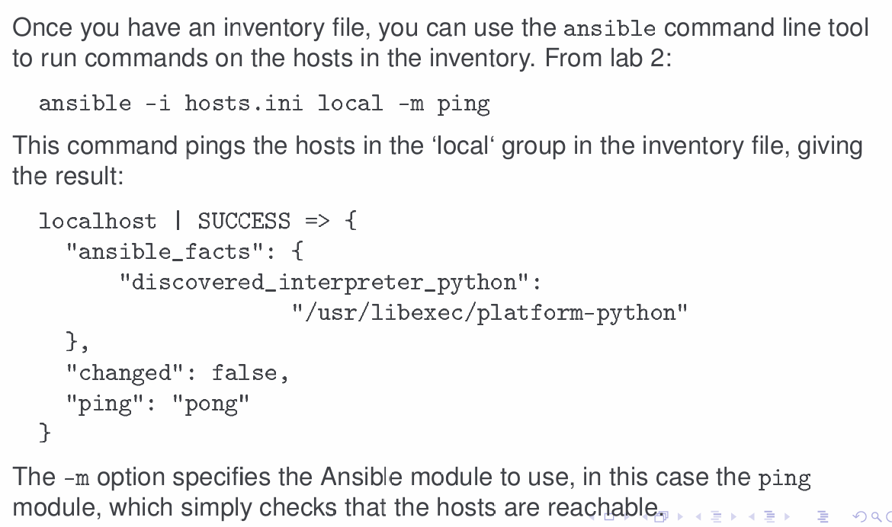


### Playbooks

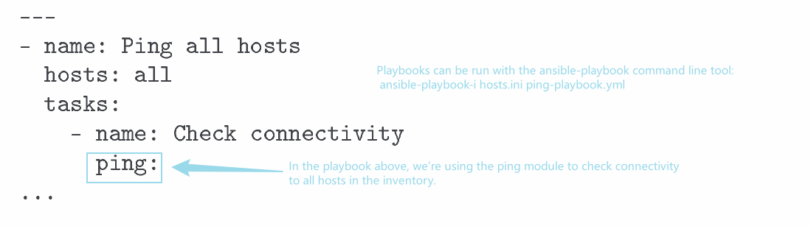


### Plays

- **Play** 是 Ansible 中执行任务的基本单元。
  - 它将一组主机映射到一系列任务，并按顺序执行。


```yaml
- name: Ensure Apache is installed
  hosts: webservers        # 应用的主机组
  become: yes              # 提升为管理员权限（sudo）
  tasks:                   # 要执行的任务列表
    - name: Install apache2 package
      ansible.builtin.yum:
        name: apache2
        state: present
```

- `hosts`: 指定任务要运行在哪些主机组上（如 webservers）。

- `become: yes`: 表示使用 sudo 提权执行。

- `tasks`: 要执行的操作任务列表，每个任务用模块（如 yum）实现。


### Tasks

- **任务（task）** 是 play 中的基本执行单元，用于自动化特定操作。

- 每个任务调用一个 **Ansible 模块** 来完成操作。

```
tasks:
  - name: Install nginx
    ansible.builtin.yum:
      name: nginx
      state: present

  - name: Start nginx service
    ansible.builtin.service:
      name: nginx
      state: started
      enabled: yes
```

- `ansible.builtin.yum`: 用于在 RHEL 或 Rocky 上安装软件包。

- `ansible.builtin.service`: 用于管理系统服务（启动、停止、设置开机启动等）。


###  Modules

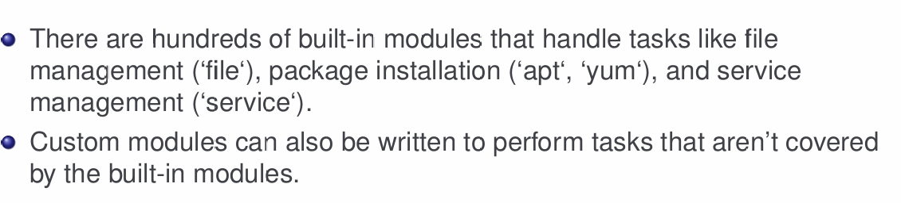


### Become

- `become` 允许任务以 root 权限运行，相当于 `sudo`。

- `become: yes` 可以写在：

  - playbook 层：作用于所有任务

  - task 层：作用于单个任务

```
- name: Install Apache on all hosts
  hosts: all
  become: yes
  tasks:
    - name: Install the latest version of Apache
      ansible.builtin.dnf:
        name: httpd
        state: latest
```


###  When

- Ansible 支持使用条件语句（`when`）来控制任务是否执行。

- 最简单的条件语句应用于单个任务：

```
when: ansible_selinux.status == "enabled"
```

- `when` 子句是**原始模板表达式**，**不需要双花括号 `{{ }}`**。

- 当运行 playbook 时，Ansible 会在所有主机上评估这个测试表达式：

  - 如果表达式为 `True`，则任务会执行；

  - 如果为 `False`，任务不会执行。


```
tasks:
  - name: Configure SELinux to start mysql on any port
    ansible.posix.seboolean:
      name: mysql_connect_any
      state: true
      persistent: true
    when: ansible_selinux.status == "enabled"
```

- **`ansible.posix.seboolean`**：用于设置 SELinux 布尔值；
- **`when`**：判断条件，仅当 SELinux 状态为 `"enabled"` 时才运行此任务。


- 所有变量在 `when` 中都可以**直接使用**，无需双大括号；
- 多用于根据主机不同状态（如系统、服务启用状态）做出差异化部署。


### Register

```
- hosts: web_servers
  tasks:
    - name: Run a shell command and register its output
      ansible.builtin.shell: /usr/bin/foo
      register: foo_result
      ignore_errors: true

    - name: Run a shell command using output of foo
      ansible.builtin.shell: /usr/bin/bar
      when: foo_result.rc == 5
```

- `register:` 用于将任务的输出结果保存为变量。
- 上面的示例中，`foo_result` 会保存 `/usr/bin/foo` 命令的返回结果。
- `when:` 用于条件判断，只有当 `foo_result.rc == 5` 时才执行 `/usr/bin/bar`。


```
- name: Ping all hosts
  hosts: all
  tasks:
    - name: Check connectivity
      ping:
      register: ping_result

    - name: Debug the ping result
      debug:
        msg: "debug says: {{ ping_result }}"
```

- `register:` 用于将 `ping` 任务的输出保存到变量 `ping_result` 中。
- `msg: "debug says: {{ ping_result }}"` 会打印一条消息，内容为 `"debug says: "` 加上 `ping_result` 的内容。
- `{{ ... }}` 是变量插值语法，用来把变量或表达式的值插入到字符串中。


### Using Register and Debug in Ansible

```
- name: Ping all hosts  
  hosts: all  
  tasks:  
    - name: Check connectivity  
      ping:  
      register: ping_result  

    - name: Debug the ping result  
      debug:  
        msg: "debug says: {{ ping_result }}"  
```

- `register:` 用于将 `ping` 任务的输出结果保存到变量 `ping_result` 中。
- `msg: "debug says: {{ ping_result }}"` 表示打印一条消息，内容是 `debug says:` 加上变量 `ping_result` 的值。
- `{{ ... }}` 是变量插值语法，用于将变量或表达式的值插入字符串中。


### Loops

````
```yaml
tasks:
  - name: Check connectivity
    ping:
    loop: "{{ range(1, 4) | list }}"
    loop_control:
      label: "Ping number {{ item }}"
```
````


- 这个 Ansible playbook 会对所有主机执行三次 ping 操作：
- `loop` 指令用于重复执行 ping 任务。`range(1, 4)` 生成 `[1, 2, 3]`，所以循环执行三次。
- `| list`：将 range 生成的对象转换为列表，使其可以被迭代。
- `loop_control`：用于自定义循环行为。`label` 参数会为每次循环指定标签。
- `label: "Ping number {{ item }}"`：指定每次循环显示的标签，其中 `item` 是当前循环的值。


### Running examples

P309-316


